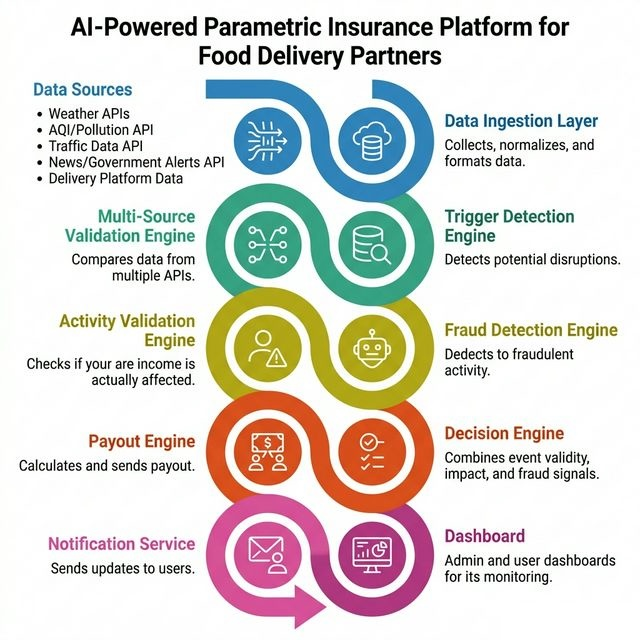

<div align="center">

# Earnly

### AI-Powered Income Protection for Delivery Partners

[](/)
[](/)
[](/)

> **"An AI-powered parametric insurance platform that automatically compensates delivery partners for income loss caused by real-world disruptions — using real-time data and intelligent validation."**

</div>

---

## The Problem

Food delivery partners earn entirely based on deliveries completed — no fixed salary, no safety net. Real-world conditions can wipe out their income overnight.

<table>
<tr>
<td width="50%">

### Environmental Factors
- Heavy rainfall → reduced visibility
- Flooding → blocked roads
- Extreme heat → limited working hours
- High pollution → unsafe conditions

</td>
<td width="50%">

### Administrative Restrictions
- City-wide curfews
- Zone closures
- Emergency situations
- Protest blockades

</td>
</tr>
</table>

**Result:** Reduced orders → Increased delivery time → **Direct income loss**

*No system currently exists to automatically compensate for these losses.*

---

## Our Solution

Earnly is an **AI-powered parametric insurance system** that:

| Step | Action |
|------|--------|
| 1 | Detects real-world disruptions via live data feeds |
| 2 | Validates authenticity across multiple trusted sources |
| 3 | Verifies actual impact on individual rider activity |
| 4 | **Automatically triggers payouts** — zero manual claims |

No paperwork &nbsp;&nbsp; No delays &nbsp;&nbsp; Fully automated

---

## Disruption Detection Rules

| Disruption Type | Trigger Condition | Severity | Payout % | Duration |
|---|---|---|---|---|
| **Heavy Rainfall** | Rainfall ≥ 50 mm/hr | High | 80% | 2h |
| **Moderate Rainfall** | Rainfall 20–50 mm/hr | Medium | 50% | 2h |
| **Extreme Heat** | Temperature ≥ 42°C | High | 60% | 3h |
| **Hazardous AQI** | AQI ≥ 300 | High | 70% | 4h |
| **Unhealthy AQI** | AQI 200–300 | Medium | 40% | 4h |
| **Flood Alert** | News alert severity = high | Critical | 100% | 6h |
| **Cyclone Alert** | News alert severity = high | Critical | 100% | 12h |
| **Curfew / Emergency** | Government-issued alerts active | High | 90% | 8h |
| **High Wind** | Wind ≥ 60 km/h | High | 70% | 3h |

---

## Architecture

<div align="center">



</div>

### Services Overview

| Component | Role |
|---|---|
| **React Frontend** | Rider dashboard, policy management, claims, risk profile, admin panel |
| **Node.js Backend** | REST API, auth, policy & billing logic, automation pipeline |
| **Firebase** | User data, policies, claims, disruptions, notifications, real-time updates |
| **Python ML Service** | Fraud detection, risk scoring, disruption validation, payout calculation |
| **Trigger Engine** | Parametric rules that auto-detect disruptions from live data |
| **Automation Pipeline** | End-to-end claim processing: detect → validate → fraud check → approve → payout |
| **Premium Engine** | Dynamic premium calculation based on city, zone, season, platform, claims history |
| **Notification Service** | Real-time rider alerts for claim status updates |

---

## End-to-End Flow

### Rider Journey

```
1. Rider registers (name, city, zone, platform, vehicle, earnings)
        ↓
2. Logs in → Dashboard shows stats, weather, active disruptions
        ↓
3. Purchases weekly policy (Basic ₹49 / Standard ₹99 / Premium ₹149)
        ↓
4. System monitors environment in real-time
        ↓
5. Disruption detected (weather API + AQI API + news API)
        ↓
6. Multi-source validation (≥ 2/3 sources must agree)
        ↓
7. Automation pipeline triggers for all affected riders
        ↓
8. ML fraud check per rider (IsolationForest model)
        ↓
9. Payout calculated based on earnings, disruption severity, coverage %
        ↓
10. Decision engine:
     • fraud_score < 0.5 → Auto-approved
     • fraud_score > 0.7 → Auto-rejected
     • Otherwise → Flagged for manual review
        ↓
11. Payout processed + rider notified in real-time
```

### Admin Journey

```
1. Admin views dashboard → policy stats, claim stats, financials, loss ratio
        ↓
2. Monitors live claim feed (auto-refreshes every 10 seconds)
        ↓
3. Reviews fraud-flagged claims + suspicious users (3+ claims in 7 days)
        ↓
4. Manual override: approve / reject / flag with reason
        ↓
5. Simulates disruptions for testing (type, city, severity)
```

---

## Insurance Plans

| Plan | Weekly Premium | Coverage | Covered Disruptions |
|---|---|---|---|
| **Basic Shield** | ₹49 | 60% | Rain, Heat |
| **Standard Guard** | ₹99 | 80% | + Pollution, Flood, Priority Processing |
| **Premium Fortress** | ₹149 | 100% | + Cyclone, Curfew, Instant Auto-Payout |

### Dynamic Premium Calculation

Premium is dynamically adjusted using 6 multipliers:

```
Adjusted Premium = Base Premium
  × City Risk       (1.0 – 1.3)    Mumbai highest
  × Zone Risk       (0.9 – 1.2)    High-risk zones pay more
  × Platform Risk   (1.0 – 1.05)   Quick-commerce slightly higher
  × Season Risk     (1.0 – 1.4)    Monsoon highest
  × Claims History  (0.95 – 1.2)   More claims = higher premium
  × Loyalty Discount (0.88 – 1.0)  4+ consecutive weeks = discount
```

---

## ML Service

The Python ML microservice powers four core capabilities:

### Fraud Detection (`POST /api/fraud-check`)
- **Model:** IsolationForest trained on 1000 synthetic samples
- **Features:** delivery count, active hours, claim amount, GPS jump distance, claims in same zone, claim-to-earnings ratio, account age, previous claims
- **Rule-based checks:**
  - GPS spoofing: > 50 km jump in < 10 minutes
  - Activity anomaly: active hours but zero deliveries
  - Amount anomaly: claim > 2x reference earnings
  - Group fraud: 3+ claims from same zone within 1 hour

### Risk Scoring (`POST /api/risk-score`)
- Per-rider risk assessment (0–100 score)
- Factors: city risk, seasonal multiplier, platform multiplier, claims history
- Returns `premium_multiplier` (0.5 – 5.0) used in premium calculation

### Disruption Validation (`POST /api/validate-disruption`)
- Cross-references 3 independent sources (weather, AQI, news)
- Validates: rainfall thresholds, wind speed, temperature extremes, AQI levels, news keywords
- **Rule:** At least 2 of 3 sources must agree for a valid disruption

### Payout Calculation (`POST /api/calculate-payout`)
- Estimates income loss based on rider earnings + disruption duration
- Applies type multipliers (flood 1.3x, cyclone 1.5x, rain 1.0x, heat 0.8x)
- `payout = estimated_loss × (coverage_percent / 100)`

---

## Decision Engine

| Signal | Weight |
|---|---|
| Disruption Confidence | High |
| Fraud Score | High |
| Fraud Flags Count | Medium |
| Disruption Severity | Medium |

**Decision Logic:**

| Condition | Outcome |
|---|---|
| `fraud_score < 0.5` AND no flags AND `confidence ≥ 0.6` | Auto-Approved |
| `fraud_score > 0.7` | Auto-Rejected |
| Everything else | Flagged for Manual Review |

---

## Adversarial Defense — Fraud Detection

| Technique | What It Catches |
|---|---|
| **GPS Spoofing Detection** | Unrealistic location jumps (> 50 km in < 10 min) |
| **Activity Verification** | Movement with zero deliveries |
| **Amount Anomaly** | Claims exceeding 2x reference earnings |
| **Group Pattern Detection** | Coordinated mass fraud (3+ claims from same zone in 1 hour) |
| **IsolationForest ML Model** | Statistical anomalies across 8 behavioral features |

---

## API Reference

### Authentication (`/api/auth`)

| Method | Endpoint | Purpose |
|---|---|---|
| POST | `/register` | Register rider with delivery profile |
| POST | `/login` | Login with Firebase token |
| GET | `/profile/:uid` | Fetch rider profile |
| GET | `/risk-profile/:uid` | Get risk score + premium multiplier |

### Policies (`/api/policies`)

| Method | Endpoint | Purpose |
|---|---|---|
| GET | `/plans` | List available insurance plans |
| POST | `/purchase` | Purchase a weekly policy |
| GET | `/my-policies/:uid` | Get rider's policies |
| POST | `/calculate-premium` | Get dynamic premium breakdown |

### Disruptions (`/api/disruptions`)

| Method | Endpoint | Purpose |
|---|---|---|
| GET | `/current/:city` | Fetch live weather + AQI + alerts |
| POST | `/check-triggers` | Evaluate parametric trigger rules |
| POST | `/simulate` | Admin: simulate a disruption |
| POST | `/process` | Admin: reprocess an existing disruption |
| GET | `/history/:city` | Get past disruptions for a city |

### Claims (`/api/claims`)

| Method | Endpoint | Purpose |
|---|---|---|
| POST | `/initiate` | Manually file a claim |
| GET | `/my-claims/:uid` | Get rider's claims |
| PATCH | `/:claimId/approve` | Admin: approve a claim |
| PATCH | `/:claimId/reject` | Admin: reject a claim |

### Admin (`/api/admin`)

| Method | Endpoint | Purpose |
|---|---|---|
| GET | `/dashboard` | Aggregate stats + financials + forecasts |
| GET | `/fraud-flags` | Flagged claims + suspicious users |
| GET | `/claims/live-feed` | Real-time claim feed (last 20) |
| PATCH | `/override/:claimId` | Manual override with reason |

### Notifications (`/api/notifications`)

| Method | Endpoint | Purpose |
|---|---|---|
| GET | `/:uid` | Get user's notifications |
| GET | `/unread-count/:uid` | Unread notification count |
| PATCH | `/:notificationId/read` | Mark notification as read |
| PATCH | `/read-all/:uid` | Mark all as read |

---

## Tech Stack

<table>
<tr>
<td><b>Frontend</b></td>
<td>React 18, Vite, Tailwind CSS, React Router, Recharts, Lucide Icons</td>
</tr>
<tr>
<td><b>Backend</b></td>
<td>Node.js, Express.js</td>
</tr>
<tr>
<td><b>AI / ML</b></td>
<td>Python, Flask, Scikit-learn (IsolationForest), NumPy</td>
</tr>
<tr>
<td><b>Database</b></td>
<td>Firebase Firestore (riders, policies, claims, disruptions, notifications)</td>
</tr>
<tr>
<td><b>External APIs</b></td>
<td>OpenWeatherMap, WAQI (Air Quality), NewsAPI</td>
</tr>
<tr>
<td><b>Payments</b></td>
<td>Razorpay (Test Mode)</td>
</tr>
<tr>
<td><b>Auth</b></td>
<td>Firebase Auth + JWT</td>
</tr>
<tr>
<td><b>Deployment</b></td>
<td>Render (Node.js app + Python ML service)</td>
</tr>
</table>

---

## Edge Case Handling

### Data-Related Issues

| Scenario | Problem | How It's Handled |
|---|---|---|
| **Incorrect Weather Data** | One source reports wrong information | Multi-source validation — at least 2 of 3 sources must agree |
| **Location Mismatch** | Disruption in one zone, not another | City divided into zones; conditions validated per rider's zone |
| **API Failure** | Data source goes down | Cached data fallback; backup APIs queried automatically |

### No Real Impact Cases

| Scenario | Problem | How It's Handled |
|---|---|---|
| **Rider Unaffected** | Disruption exists but rider works normally | Activity threshold — if deliveries ≥ 70% of normal → no payout |
| **Short Duration** | Brief event with no real income loss | Minimum duration filters per disruption type |

### System-Level Issues

| Scenario | Problem | How It's Handled |
|---|---|---|
| **Duplicate Payouts** | Same event processed twice | Unique event ID assigned; duplicate claims blocked per rider+disruption |
| **Late Policy Activation** | User activates after disruption starts | Policy start time validated against event timestamp; backdating blocked |
| **ML Service Down** | Python service unavailable | Fallback logic in Node.js: severity-based decisions + formula-based payouts |

### Fraud Cases

| Scenario | Problem | How It's Handled |
|---|---|---|
| **GPS Spoofing** | Fake location in disruption zone | Movement analysis detects jumps > 50 km in < 10 min |
| **Zero Delivery Activity** | Moving but no orders completed | Activity verification flags movement with zero deliveries |
| **Inflated Claims** | Claim exceeds actual earnings | Amount anomaly check: claim > 2x reference earnings flagged |
| **Coordinated Group Fraud** | Multiple users fake behaviour simultaneously | Group pattern detection: 3+ claims from same zone in 1 hour |

---

## System Reliability

- The system uses **3 independent data sources** (Weather API, AQI API, News API), reducing dependency on any single provider
- If one API fails, the system continues with remaining sources + cached fallbacks
- If the ML service is unavailable, the backend falls back to rule-based severity scoring and formula-based payout calculations
- Unique event IDs prevent duplicate claim processing
- Modular microservice architecture allows independent scaling and deployment

---

## Key Features

| Feature | Description |
|---|---|
| **Zero-Claim Payouts** | Fully automated — riders never need to file a claim |
| **Real-Time Monitoring** | Continuous data streams from weather, traffic, and news APIs |
| **AI Fraud Detection** | IsolationForest ML model + rule-based checks across 8 behavioral features |
| **Dynamic Premiums** | Personalized pricing based on city, zone, season, platform, and history |
| **Multi-Source Validation** | At least 2 of 3 independent sources must agree before triggering |
| **Instant Auto-Payouts** | Claims auto-approved in seconds when fraud score is low |
| **Admin Controls** | Override claims, simulate disruptions, monitor live feed, view fraud flags |
| **Risk Profiling** | Per-rider risk score with detailed factor breakdown |
| **Loyalty Rewards** | Premium discount for 4+ consecutive weeks of coverage |
| **Notification System** | Real-time bell notifications for claim status updates |

---

<div align="center">

## Conclusion

Earnly provides a **fair, automated, and scalable** safety net for gig economy workers.

By combining real-time data intelligence with AI-driven validation, it ensures that delivery partners are compensated quickly and accurately — **without lifting a finger.**

---

</div>
